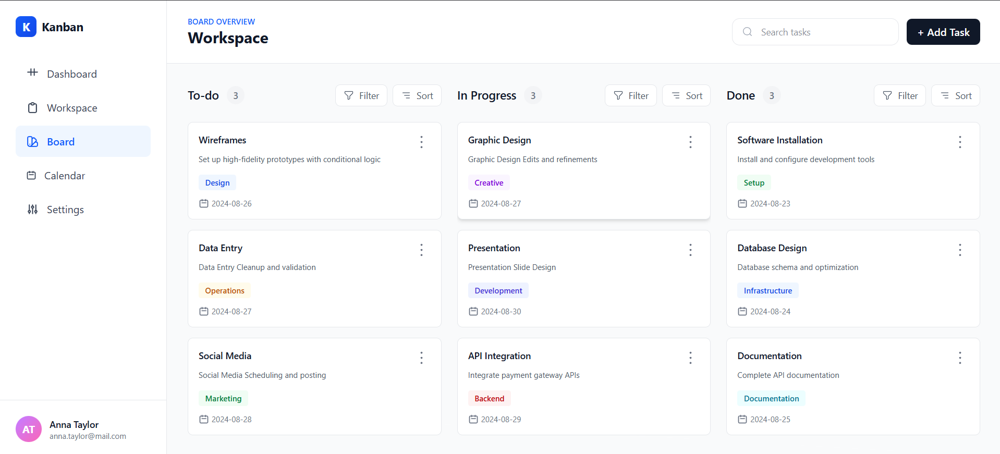
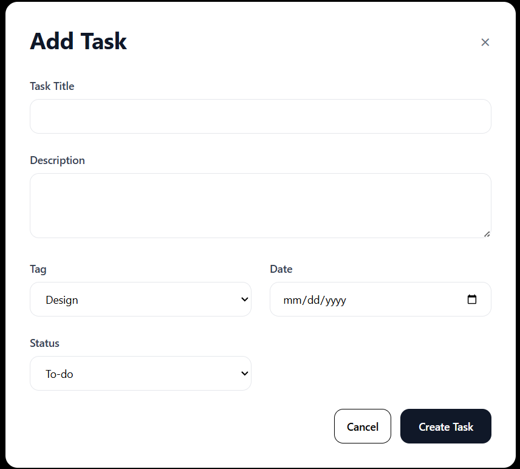

# Kanban Task Manager

A robust, responsive Kanban Board application built with **React** and **Tailwind CSS**. This project converts a static HTML template into a dynamic single-page application, managing complex state (CRUD, filtering, sorting) using **Context API** and **useReducer** without external state management libraries.

**Live Site:** [Live](https://kanban-board-lws-assignment-4.vercel.app/)
**Repository:** [Repository Link](https://github.com/TasnimurRahmanShakir/Kanban-Board-LWS-Assignment-4.git)

## 🚀 Project Overview

This project serves as the solution for the **LWS Reactive Accelerator Assignment 3**. The goal was to build a fully functional Task Manager that allows users to track project progress through "To-Do", "In Progress", and "Done" stages.


### Key Features

- **Dynamic Task Board:** View tasks organized by status in three distinct columns.
- **CRUD Operations:**
  - **Create:** Add new tasks via a modal form.
  - **Read:** View task details including tags and dates.
  - **Update:** Edit existing task details (Title, Description, Tags, Priority).
  - **Delete:** Remove tasks with a confirmation prompt.
- **Task Movement:** Seamlessly move tasks between columns (e.g., "To-Do" to "In Progress") using the card menu.
- **Advanced Filtering:** Filter tasks within specific columns by their Tags (e.g., Design, API Integration).
- **Sorting:** Sort tasks within columns by Date (Newest First vs. Oldest First).
- **Global Search:** Real-time search functionality to find tasks by title across the entire board.
- **Tag System:** Visual color coding for different tags (e.g., specific colors for "Design" vs "Backend") as per the design specs.
- **Responsive UI:** Fully optimized layout for Mobile, Tablet, and Desktop views.


## 📸 Screenshots
### Homepage Overview


### Add Or Edit Task


## 🛠️ Tech Stack

- **Library:** React.js (Vite)
- **Styling:** Tailwind CSS
- **State Management:** React Context API + useReducer Hook
- **Icons:** Custom SVG Components
- **Deployment:** Vercel / Netlify

## 📂 Project Structure

The project follows a scalable "Senior Developer" folder structure, separating concerns between Logic (Context), UI (Components), and Data.

```bash
src/
├── assets/             # Static assets (images, logos)
├── components/
│   ├── board/          # Core Board Logic
│   │   ├── AddTaskModal.jsx  # Handles both Add and Edit actions
│   │   ├── KanbanBoard.jsx   # Main grid layout
│   │   ├── TaskCard.jsx      # Individual card with Dropdown menu
│   │   └── TaskColumn.jsx    # Handles per-column Filtering & Sorting
│   ├── layout/         # Global App Layout
│   │   ├── Header.jsx        # Contains Search and Add Button
│   │   └── Sidebar.jsx       # Navigation sidebar
│   └── ui/             # Reusable Atomic Components
│       ├── Badge.jsx         # Tag component with dynamic colors
│       └── Icons.jsx         # Centralized SVG icons
├── context/            # Global State Management
│   ├── TaskContext.jsx       # Context Provider
│   ├── taskReducer.js        # Reducer logic for CRUD & Move
│   └── initialData.js        # Mock data and Tag Color mappings
├── App.jsx
└── main.jsx


```


## 🚀 Getting Started

To run this project locally, follow these steps:

1.  **Clone the repository:**
    ```bash
    git clone https://github.com/TasnimurRahmanShakir/Kanban-Board-LWS-Assignment-4.git

    cd Kanban-Board-LWS-Assignment-4
    ```
2.  **Install dependencies:**
    ```bash
    npm install
    # or
    yarn install
    ```
3.  **Start the development server:**
    ```bash
    npm run dev
    # or
    yarn dev
    ```
    The application will be accessible at `http://localhost:5173` (or another port if 5173 is in use).

---

## 🤝 Contribution

Feel free to fork the repository, open issues, or submit pull requests.